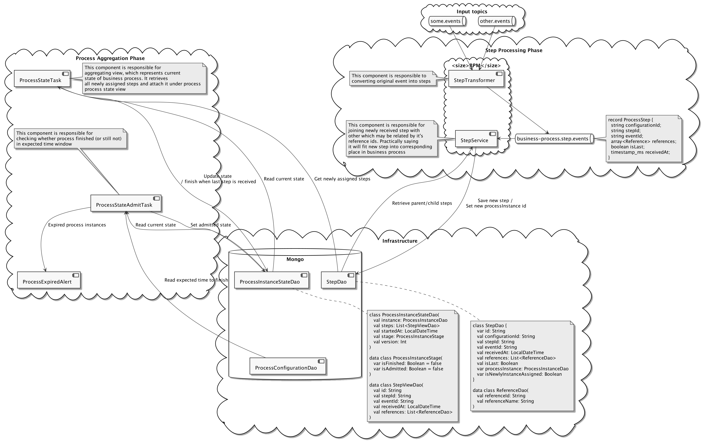
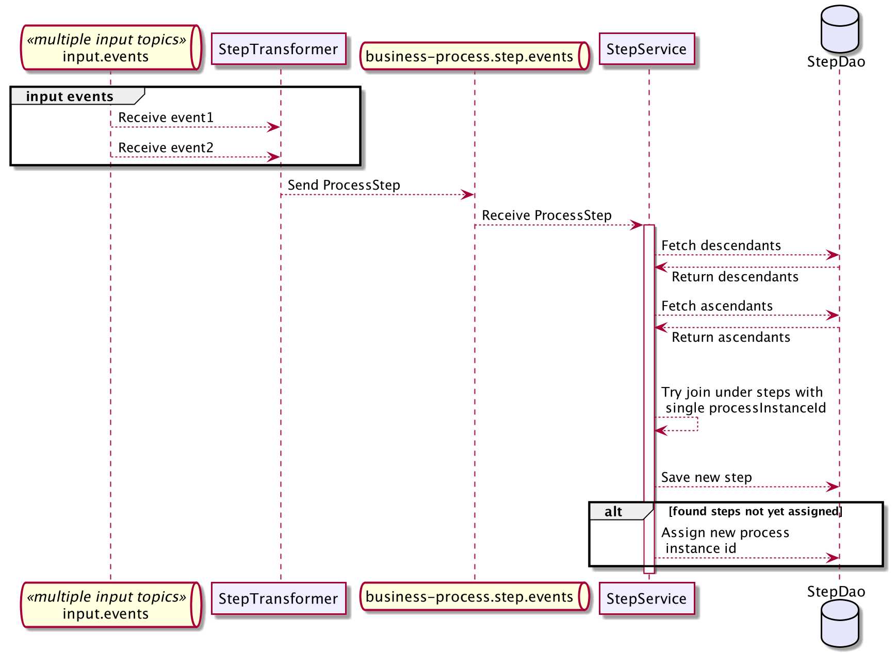
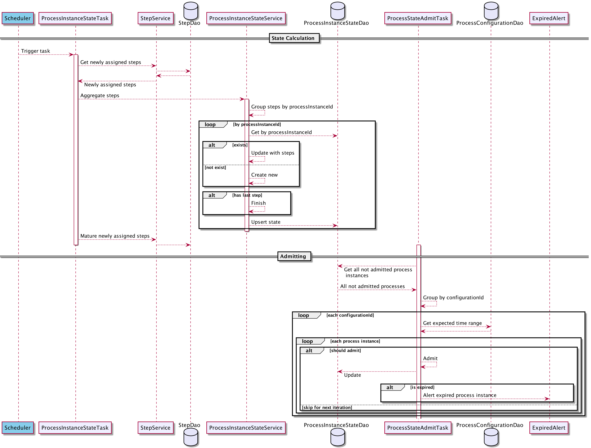
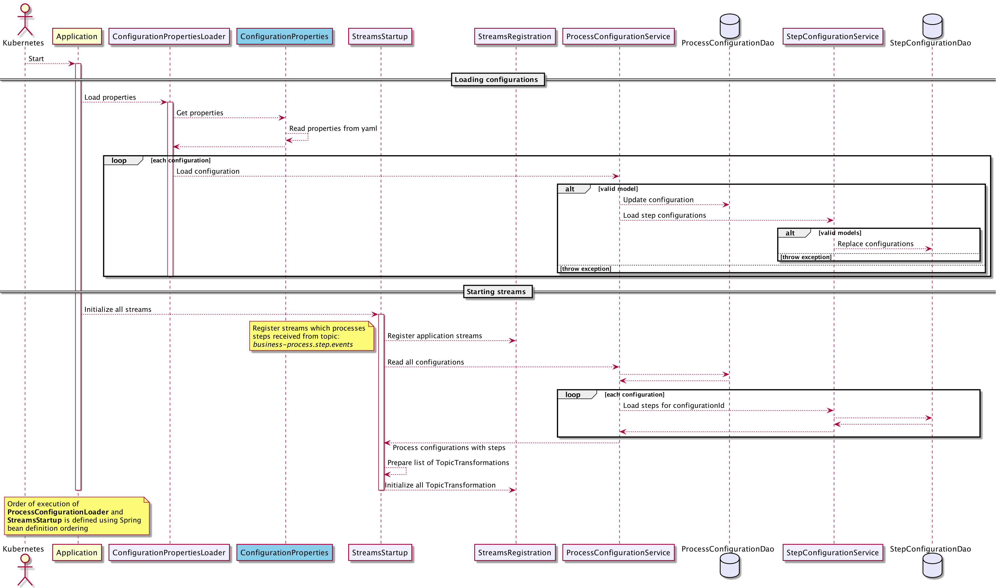

# business-process-monitor

# Documentation

Application designed can be used for dynamic tracking of outgoing processes presented as events on kafka topics.  
We can dynamically describe such process through configuration options and define alerts once some process hanged or delayed in a particular step.

This doc contains: 
- [**Overview section**](#overview)
- [**API description and configuration**](#api-v2)
- [**Howto: local setup**](#how-to-run-locally)

## Overview

### High level view

### Step processing flow

### Aggregation flow

### Application initialization flow
Current version initialized through application properties, during startup. It can be changed and done 
in the way, that configuration is manipulated though REST or Kafka interfaces.

Current initialization flow is depicted below:


## API V2

### Description of configuration:
| Name              |Description                                    | Type      |Example
|---                |---                                            |---        |---
| id                | Unique id of the configuration                | String    | processCreated
| description       | This description will be added to logs/alerts when ... | String    | ProcessCreated not received withing expected time range
| expectToFinishIn  | Expected time when business process finish in | Duration  | 30s/3m/10d
| steps             | A list of steps for given configuration       | List<StepConfiguration> | check below table

### StepConfiguration description
| Name              | Description                                                                       | Required  | Example
|---                |---                                                                                |---        |---
| type              | Step type. [Available options](#step-types)                                       | Yes       | single
| topic             | Topic name                                                                        | Yes       | process.create.commands
| description       | Human readable step description                                                    | Yes       | Create Process LTO command
| schemaName        | Payload full schema name                                                          | Yes       | com.djeremy.avro.process.CreateProcess
| eventIdSchemaPath | Path to field from the payload. If mapper is missing event **key** will be used   | No        | paymentId.value
| referenceIdSchemaPaths    | List of paths of fields from the payload, which can be used as reference keys for joining events for the next steps | No | - paymentId.value - amountDueId.value
| indicateProcessFinished | Mark step as last step in process. This is used for defining finished state for process instance | No (default *false*) | true


`eventId` is used to identify a current event. When step is being saved, it always generates **new unique identifier**, but it also should preserve `eventId`, which represents the event itself.
When `eventIdSchemaPath` is not specified **event key** will be used. `referenceIdSchemaPaths` is representing reference ids extracted from payload, by which this step can be joined with another steps. 


**How it works.**

When event is received, and `eventId` extracted from payload or key, processor will try to find any step, which
holds same id in values represented by `referenceIdSchemaPaths`. If such exists, then steps will be joined with same process id, if not, nothing is happened. 

TODO!!! Probably can think about specifying concrete step to which it would like to join. Can be optional. 

#### Step types

Step types should provide additional behavior or enhance current flow with additional logic. It's also allow reacting on potential corner cases in flexible and elegant way.  

#### Single

--- 

Type fields value `single`

---

Single event type has no additional fields and do not expose additional behavior to the one describe [above](#stepConfiguration-description).

#### Multiple exclusive 

--- 

Type fields value `multipleExclusive`

---
This type is designed to represent a situation when process can finish with one of the specified events on a single topic. It acts as logical OR operator.

Additional fields: 

| Name                                  | Description                    | Required  | Example
|---                                    |---                             |---        |---
| altSchemaName                 | Same as `schemaName`           | Yes       | com.djeremy.avro.process.CreateProcess
| altEventIdSchemaPath          | Same as `eventIdSchemaPath`           | No        | paymentId.value
| altReferenceIdSchemaPaths     | Same as `referenceIdSchemaPaths`  | No | - paymentId.value - amountDueId.value
| altIndicateProcessFinished    | Same as `indicateProcessFinished` | No | true


### Example usage when keys are different, connection field->key
The `amountDueId.value` is a key in the `com.djeremy.avro.payments.PaymentAuthorised` schema 
```yaml
djeremy.kafka.system.monitor.v2:
  configurations:
    - id: processCreated
      description: 'StatusThree or StatusFour not received withing expected time range, staring from process creation'
      steps:
        - type: single
          description: "Create Process"
          topic: process.create.commands
          schemaName: com.djeremy.avro.process.CreateProcess
          eventIdSchemaPath: processId.value
        - type: single
          description: "StatusOne process status"
          topic: process.status.events
          schemaName: com.djeremy.avro.process.status.StatusOne
          eventIdSchemaPath: processId.value        
        - type: single
          description: "StatusTwo process status"
          topic: process.progress.events
          schemaName: com.djeremy.avro.process.status.StatusTwo
          eventIdSchemaPath: processId.value
        - type: multipleExclusive
          description: "StatusThree or StatusFour process status"
          topic: process.progress.events
          schemaName: com.djeremy.avro.process.status.ProcessThree
          eventIdSchemaPath: processId.value 
          alternativeSchemaName: com.djeremy.avro.process.status.ProcessFour
          alternativeEventIdSchemaPath: processId.value
      expectToFinishIn: 30s
```

You can also reference [test configuration example](./src/test/resources/application-test.yaml)


## How to run locally

### Pre-requisites:
* Must have
    * [Docker](https://docs.docker.com/get-docker/)
    * [Kind](https://kind.sigs.k8s.io/docs/user/quick-start/#installation)
    * [Kubectl](https://kubernetes.io/docs/tasks/tools/install-kubectl/)
### Kind
Navigate into [kind folder](./local_setup/kind) and create cluster with provided configuration: 
```
kind create cluster --config configuration.yaml
```
Cluster has already predefined port mapping and expose kubernetes services into host machine network.

### Kubernetes

#### Set up
Navigate into kubernetes folder and apply kustomization configuration:
```
kubectl apply -k  ./
```

This will create all necessary pod and services including **kafka**, **zookeeper**, **schema registry**, **mongo** and **kafka-hq** 
for easy debugging and access to content of kafka. 

Kafka-hq will be available under http://localhost:19999/local/topic link.

List of predefined topics can be changed [here](./local_setup/kubernetes/kafka-deployment.yaml)(see lifecycle section) or created manually through
kafka-hq.

#### Cheatsheet

```
kubectl get pods
kubectl get pod bpm-kafka -o wide
kubectl describe pods bpm-kafka
kubectl cluster-info
kubectl port-forward bpm-kafka 9092:9092 &
kubectl delete pods bpm-kafka --grace-period=0 --force
kubectl logs bpm-kafka bpm-mongo -f

kubectl exec -it bpm-kafka --container kafka-1 -- /bin/bash

kubectl get events -w

kubectl get pods -o=jsonpath='{range .items[*]}{"\n"}[{.metadata.name} {"\n"} {range .status.containerStatuses[*]}[{.name}, {.ready}, {.restartCount}, {.state}], {"\n"} {end} {"\n\n"}] {end}'

docker system prune

kind load docker-image docker_image
```

#### Mongo
Helpful mongo queries can be found [here](./helper/mongo_queries.txt)

Use `mongo_local` profile for debug logging of mongo queries and operations. 

### Application
Please start application with `local` profile. That profile contains all prepared connection strings and configurations 
with regard infrastructure we early built using kubernetes.

Local application set up contains single process configuration with id `processCreated`. Configuration located in [application.yaml](./src/main/resources/application.yaml) file. Infrastructure
configuration contains already defined such topics and streams have to run normally.

In order to test manually and send records, you can use `publisher` sub project. Please see [Publisher.kt](./publisher/src/main/kotlin/com/djeremy/publisher/Publisher.kt) for more details.
It will generate CreateProcess commands and ProcessCreated events. 